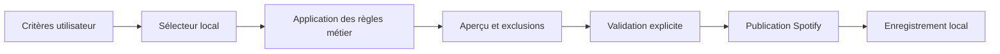

# Lot 4 - Génération Et Publication De Playlists Par Genre

Date de rédaction : 2026-06-29
Date de vérification Spotify : 2026-06-29

Ce document décrit le futur générateur de playlists du module Music.

## Sources Spotify Confirmées

Sources officielles utiles à ce lot :

- https://developer.spotify.com/documentation/web-api/reference/create-playlist
- https://developer.spotify.com/documentation/web-api/reference/add-items-to-playlist
- https://developer.spotify.com/documentation/web-api/concepts/rate-limits

## Principe Central

La playlist est construite d'abord depuis la base locale, puis publiée vers Spotify.

Flux cible :

```text
critères
-> sélection locale
-> règles métier
-> aperçu
-> validation explicite
-> publication Spotify
-> trace locale
```

## Objectifs

- générer des playlists personnelles à partir des genres validés ;
- garder la logique de sélection entièrement testable sans réseau ;
- publier vers une playlist privée Spotify quand l'utilisateur confirme ;
- conserver un snapshot local idempotent et rejouable.

## Hors Périmètre

- playlists publiques ;
- collaboration multi-utilisateur ;
- déclenchement automatique récurrent ;
- optimisation algorithmique prématurée ;
- suppression automatique d'anciennes playlists Spotify.

## Architecture Recommandée

Séparation stricte :

- `PlaylistGenerator` = logique métier locale ;
- `SpotifyPlaylistPublisher` = adaptateur réseau Spotify ;
- `PlaylistPreviewBuilder` = transformation de la sélection en aperçu UI ;
- `GeneratedPlaylistRepository` = persistance métier ;
- `PlaylistCriteriaValidator` = validation des filtres d'entrée.

Le générateur ne doit jamais appeler directement Spotify.

## Flux Métier



## Critères De Sélection

Critères à prévoir dans le modèle, même si l'UI peut arriver progressivement :

- genre ou sous-genre ;
- période d'écoute ;
- période de sortie quand disponible plus tard ;
- durée cible ;
- nombre maximal de titres par artiste ;
- exclusion d'artistes ;
- exclusion de titres ;
- préférence pour les titres peu écoutés ;
- exclusion de titres déjà utilisés récemment ;
- inclusion éventuelle de favoris plus tard ;
- choix du caractère aléatoire ;
- graine de reproductibilité éventuelle.

## Règles Métier Recommandées

### Source Des Candidats

- partir des `Track` locaux ;
- ne retenir que les titres rattachés à des artistes ayant un genre validé ;
- garder séparée la raison d'exclusion d'un titre non publiable.

### Titres Sans URI Spotify

Règle recommandée :

- ils peuvent participer à l'aperçu local ;
- ils ne doivent pas être publiés ;
- l'aperçu doit les afficher comme exclus avec motif `uri_spotify_absente`.

### Limite Par Artiste

- appliquer une contrainte configurable `maxTracksPerArtist` ;
- la règle s'applique avant la publication ;
- en cas d'égalité, utiliser un tie-breaker stable documenté.

### Durée Cible

- viser une durée cible, pas une durée exacte ;
- accepter une tolérance configurable ;
- si la sélection dépasse la cible, réduire par règles stables avant publication.

### Aléatoire

Décision recommandée :

- supporter une graine optionnelle pour rendre une génération rejouable ;
- si aucune graine n'est fournie, générer une graine et la stocker dans le snapshot.

### Exclusions Récentes

- prévoir un filtre des titres déjà utilisés récemment dans des générations précédentes ;
- la fenêtre de récence doit être un critère explicite, pas une règle cachée.

## Aperçu Avant Publication

L'aperçu doit montrer :

- la liste ordonnée des titres retenus ;
- les durées cumulées ;
- le nombre de titres par artiste ;
- les exclusions ;
- les titres sans URI Spotify ;
- la playlist Spotify cible si une mise à jour est demandée.

L'aperçu doit être recalculable sans appel réseau.

## Publication Spotify

### Création

Création recommandée :

- utiliser `POST /me/playlists` ;
- forcer `public=false` ;
- ne pas demander `playlist-modify-public`.

### Ajout D'Items

- utiliser `POST /playlists/{playlist_id}/items` ;
- envoyer des lots de 100 URIs maximum ;
- privilégier le corps JSON plutôt que des query params trop longues.

### Mise À Jour D'Une Playlist Existante

Recommandation de premier niveau :

- commencer par créer une nouvelle playlist privée par génération ;
- documenter la mise à jour d'une playlist existante comme évolution contrôlée ;
- si la mise à jour est ajoutée plus tard, exiger une stratégie d'idempotence plus stricte.

## Idempotence Et Traçabilité

### Snapshot Local

Chaque génération doit persister :

- les critères d'entrée ;
- la graine ;
- la version du moteur ;
- la liste ordonnée des titres sélectionnés ;
- les exclusions ;
- les URI publiables ;
- le résultat de publication.

### Réessai

Le réessai doit se baser sur le snapshot, pas sur un recalcul implicite différent.

Règle recommandée :

- un réessai de publication réutilise la même sélection figée ;
- un recalcul volontaire crée une nouvelle génération.

## Gestion Des Échecs Partiels

Scénarios :

- playlist créée mais ajout des items interrompu ;
- premier lot ajouté, second lot échoué ;
- perte de connexion après création.

Stratégie réaliste :

- enregistrer le `spotifyPlaylistId` dès sa création ;
- enregistrer le nombre d'items déjà poussés ;
- proposer un `retry publish` sur la même génération ;
- ne pas promettre un rollback parfait, car Spotify ne fournit pas de transaction globale.

Décision pragmatique :

- le rollback automatique complet n'est pas la stratégie par défaut ;
- la priorité est la reprise sans doublons.

## Modèle Métier Recommandé

### `GeneratedPlaylist`

- `id`
- `name`
- `criteria`
- `generatedAt`
- `generatorVersion`
- `randomSeed` nullable
- `spotifyPlaylistId` nullable
- `spotifyPlaylistUri` nullable
- `spotifyPlaylistUrl` nullable
- `publicationStatus`
- `publishedAt` nullable
- `lastPublicationError` nullable
- `selectionSnapshot`

Statuts probables :

- `draft`
- `previewed`
- `publishing`
- `published`
- `partially_published`
- `failed`

### `GeneratedPlaylistItem`

- `generatedPlaylist`
- `track`
- `position`
- `spotifyTrackUri` nullable
- `included`
- `exclusionReason` nullable
- `publishedAt` nullable
- `publicationStatus`

## Routes, Contrôleurs, Services Et Templates Probables

Routes probables :

- `GET /private/music/playlists/generate`
- `POST /private/music/playlists/preview`
- `POST /private/music/playlists/publish`
- `POST /private/music/playlists/{id}/republish`
- `GET /private/music/playlists/{id}`

Contrôleurs probables :

- `PlaylistGenerationController`

Services probables :

- `PlaylistCriteriaValidator`
- `PlaylistCandidateSelector`
- `PlaylistGenerator`
- `PlaylistPreviewBuilder`
- `SpotifyPlaylistPublisher`
- `GeneratedPlaylistService`

Templates probables :

- `templates/private/music/playlists/generate.html.twig`
- `templates/private/music/playlists/show.html.twig`

## Tests Recommandés

### Unitaires

- filtrage par genre ;
- limite par artiste ;
- durée cible ;
- exclusion des titres récents ;
- reproductibilité par graine ;
- exclusion des titres sans URI Spotify ;
- transformation en lots de 100 URIs maximum.

### Fonctionnels

- génération d'un aperçu ;
- validation explicite avant publication ;
- publication simulée via faux publisher ;
- reprise d'une publication partielle ;
- affichage de l'historique des générations.

### Réseau

- pas de test Spotify réel dans la suite standard ;
- doubles injectés pour le publisher.

## Vérifications Manuelles Réelles

- génération d'une playlist depuis un genre donné ;
- validation de l'aperçu ;
- création effective d'une playlist privée Spotify ;
- vérification de l'ordre des titres publiés ;
- simulation d'un échec après un premier lot ;
- réessai sans doublon.

## Migrations Probables

- création de `music_generated_playlists`
- création de `music_generated_playlist_items`
- éventuelle table d'historique de publication si le besoin d'audit devient plus fin

## Critères D'Acceptation Du Lot 4

- la sélection locale est possible sans appel réseau ;
- l'aperçu montre inclusions et exclusions ;
- la publication crée une playlist privée Spotify ;
- les ajouts sont envoyés en lots compatibles avec la limite Spotify ;
- une publication interrompue peut être reprise sans dupliquer les items déjà envoyés ;
- chaque génération laisse une trace locale complète.

## Décisions À Valider Avant Implémentation

- faut-il créer systématiquement une nouvelle playlist ou offrir aussi le mode mise à jour dès le premier jet ;
- quelle stratégie d'ordre privilégier par défaut ;
- faut-il conserver un champ de nommage automatique basé sur le genre et la date ;
- quelle fenêtre de récence choisir pour l'exclusion des titres déjà utilisés.
