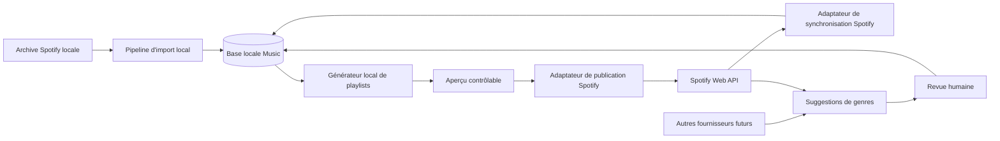

# Architecture Cible - Intégration Spotify Du Module Music

Date de rédaction : 2026-06-29
Date de vérification Spotify : 2026-06-29

Ce document décrit l'architecture cible de la future intégration Spotify dans le module privé `Music`.

Il ne décrit pas l'import d'archive locale déjà en place en détail. Cette base reste cadrée par [music-listening-history-specification.md](music-listening-history-specification.md).

## Vision

L'intégration Spotify doit compléter le module Music existant sans le renverser.

Source de vérité par domaine :

- archive Spotify locale = source de vérité de l'historique d'écoute ;
- base locale Symfony = source de vérité métier du module Music ;
- genres validés manuellement = source de vérité de la classification personnelle ;
- Spotify Web API = fournisseur externe de synchronisation, de rapprochement et de métadonnées ;
- autres fournisseurs futurs = sources de suggestions seulement.

## Objectifs

- connecter un compte Spotify personnel de manière sécurisée dans la zone privée ;
- synchroniser des métadonnées utiles sans rendre l'application dépendante de Spotify ;
- enrichir progressivement les artistes, titres et playlists locales ;
- garder un workflow humain explicite pour les genres ;
- générer des playlists à partir de la base locale puis les publier vers Spotify.

## Hors Périmètre

- remplacement de l'archive locale comme source de référence ;
- synchronisation temps réel ;
- multi-utilisateur complet de la zone privée ;
- inférence automatique d'un genre métier définitif ;
- dépendance obligatoire à MusicBrainz, Last.fm ou un autre fournisseur tiers ;
- tests réseau Spotify dans la suite locale standard ;
- implémentation de production dans cette tâche.

## Faits Confirmés Côté Spotify

Faits confirmés dans la documentation officielle Spotify au 2026-06-29 :

- pour une application serveur capable de stocker le secret client, Spotify recommande le `Authorization Code` flow plutôt que PKCE ; PKCE reste conseillé quand le secret client ne peut pas être protégé ;
- les redirect URIs doivent correspondre exactement à celles déclarées dans l'application Spotify ; seule exception : une URI loopback IP peut utiliser un port dynamique ;
- `localhost` n'est plus autorisé comme redirect URI ; Spotify exige HTTPS sauf pour les loopbacks `127.0.0.1` ou `[::1]` ;
- les nouvelles applications démarrent en `development mode` ;
- en `development mode`, le propriétaire doit avoir Spotify Premium, l'application accepte jusqu'à 5 utilisateurs authentifiés et chaque utilisateur doit être allowlisté ;
- l'`extended quota mode` ne s'applique plus aux individus depuis le 2025-05-15 ; Spotify n'accepte les demandes que pour des organisations ;
- les access tokens expirent après 1 heure ;
- les refresh tokens émis pour les applications du Developer Dashboard expirent après 6 mois et leur rafraîchissement n'étend pas cette durée ;
- un refresh peut retourner un nouveau refresh token, mais pas systématiquement ;
- `invalid_grant` signifie qu'il faut abandonner le refresh token et relancer une autorisation utilisateur ;
- les limites de taux sont calculées sur une fenêtre glissante de 30 secondes et un `429` retourne normalement `Retry-After` ;
- en `development mode`, plusieurs endpoints bulk ont été supprimés en février 2026, notamment `GET /tracks`, `GET /albums` et `GET /artists` ;
- les endpoints playlist ont été renommés de `/tracks` vers `/items` ;
- pour les playlists, `items` n'est renvoyé que pour les playlists possédées par l'utilisateur ou collaboratives ;
- le champ `genres` des objets `artist` est marqué `Deprecated` ;
- les champs `followers` et `popularity` des objets `artist` sont retirés du mode développement 2026 ;
- l'endpoint `GET /artists/{id}/top-tracks` a été supprimé en `development mode`.

Sources officielles principales :

- https://developer.spotify.com/documentation/web-api/concepts/authorization
- https://developer.spotify.com/documentation/web-api/concepts/redirect_uri
- https://developer.spotify.com/documentation/web-api/concepts/quota-modes
- https://developer.spotify.com/documentation/web-api/concepts/rate-limits
- https://developer.spotify.com/documentation/web-api/tutorials/code-flow
- https://developer.spotify.com/documentation/web-api/tutorials/refreshing-tokens
- https://developer.spotify.com/documentation/web-api/tutorials/february-2026-migration-guide
- https://developer.spotify.com/documentation/web-api/reference/get-an-artist

## Conséquences D'Architecture

- le module doit rester utilisable même sans connexion Spotify active ;
- l'intégration doit viser un usage personnel en `development mode`, pas un produit multi-utilisateur public ;
- le design doit éviter toute stratégie reposant sur les anciens endpoints bulk ;
- les genres Spotify ne doivent jamais être promus automatiquement en genre métier validé ;
- les objets Spotify doivent être conservés comme snapshots externes ou suggestions, pas comme vérité métier ;
- la logique de génération de playlists doit rester purement locale jusqu'à l'étape de publication.

## Architecture Cible

Frontières de responsabilité :

- import archive : historique brut, normalisation prudente, agrégats locaux ;
- connexion Spotify : OAuth, tokens, état de connexion, erreurs techniques ;
- synchronisation Spotify : appels HTTP, pagination, rate limiting, snapshots externes ;
- rapprochement : liaison prudente entre ressources Spotify et entités locales ;
- genres : taxonomie personnelle, suggestions externes, revue humaine ;
- playlists : sélection métier locale, aperçu, publication Spotify, traçabilité.

## Modèle De Données Proposé

Le modèle exact reste à finaliser en implémentation, mais les responsabilités suivantes doivent exister.

### Connexion

`SpotifyConnection`

- propriétaire interne logique, avec un design extensible à plusieurs comptes plus tard ;
- `spotifyUserId` ;
- `spotifyDisplayName` nullable ;
- `spotifyProfileUri` nullable ;
- `spotifyProfileUrl` nullable ;
- `encryptedRefreshToken` ;
- `grantedScopes` ;
- `connectedAt` ;
- `lastSuccessfulSyncAt` nullable ;
- `lastFailureAt` nullable ;
- `lastTechnicalError` nullable, non sensible ;
- `connectionState`.

Recommandation :

- utiliser une ligne par propriétaire logique, par exemple `ownerKey = private_admin` aujourd'hui ;
- ne pas surarchitecturer un vrai système multi-comptes tant qu'il n'existe qu'un seul usage personnel ;
- garder malgré tout une clé de propriétaire explicite plutôt qu'un singleton codé en dur.

### Synchronisation Externe

`SpotifySyncRun`

- type de synchronisation ;
- statut ;
- dates de début et fin ;
- compteurs ;
- checkpoint de pagination ;
- résumé d'erreur non sensible ;
- empreinte de configuration.

Snapshots externes probables :

- `SpotifySavedTrackSnapshot` ;
- `SpotifyFollowedArtistSnapshot` ;
- `SpotifyPlaylistSnapshot` ;
- `SpotifyPlaylistItemSnapshot` ;
- éventuellement `SpotifyArtistMetadataSnapshot` et `SpotifyTrackMetadataSnapshot` si la duplication ciblée simplifie les re-syncs.

### Liaisons De Rapprochement

Pour éviter la fusion destructive, la recommandation est de séparer :

- le snapshot Spotify ;
- la liaison validée vers l'entité locale ;
- la donnée locale métier.

Exemples probables :

- `SpotifyArtistMatch`
- `SpotifyTrackMatch`

Chaque liaison doit stocker au minimum :

- l'entité locale ;
- l'identifiant Spotify ;
- la méthode de matching ;
- le niveau de confiance ;
- le statut de revue si la correspondance n'est pas certaine ;
- les dates de création et de dernière confirmation.

### Genres

Le modèle actuel `Genre` et `ArtistGenre` doit évoluer, pas être remplacé aveuglément.

Extensions recommandées :

- hiérarchie simple `Genre.parent` nullable ;
- éventuellement `Genre.description` et `Genre.isActive` ;
- `GenreAlias` pour synonymes et variantes ;
- `GenreSuggestion` pour les sources externes ;
- conservation d'un lien métier validé séparé des suggestions.

### Playlists Générées

`GeneratedPlaylist`

- nom ;
- critères sérialisés ;
- date de génération ;
- version du moteur ;
- statut de publication ;
- `spotifyPlaylistId` nullable ;
- `spotifyPlaylistUri` nullable ;
- snapshot local de la sélection ;
- résumé d'erreur.

`GeneratedPlaylistItem`

- référence à la génération ;
- titre local ;
- ordre ;
- URI Spotify nullable ;
- raison d'exclusion éventuelle ;
- statut de publication.

## Règles Structurantes

### Non Écrasement

- une donnée manuelle locale n'est jamais écrasée automatiquement par Spotify ;
- une suggestion de genre n'est jamais promue automatiquement en genre validé ;
- une liaison ambiguë n'est jamais fusionnée automatiquement ;
- un échec Spotify ne supprime jamais la donnée locale existante.

### Provenance

Toute donnée enrichie importante doit conserver :

- sa source ;
- sa date d'import ;
- sa version brute ou son payload de référence ;
- son statut de revue si elle n'est pas déjà validée.

### Tolérance À L'Absence De Spotify

- l'UI locale doit afficher l'état de connexion ;
- le module Music doit fonctionner avec l'import d'archive seul ;
- l'indisponibilité Spotify ne doit pas bloquer l'exploration locale ni le travail sur les genres ;
- la génération locale doit pouvoir produire un aperçu même si certains titres n'ont pas d'URI Spotify.

## Options Techniques Pour Le Client Spotify

### Option A - Implémentation légère avec composants Symfony

Contenu typique :

- `symfony/http-client` pour `accounts.spotify.com` et `api.spotify.com` ;
- services dédiés `SpotifyAccountsClient`, `SpotifyWebApiClient`, `SpotifyTokenManager`, `SpotifySyncOrchestrator` ;
- DTO internes explicites ;
- chiffrement applicatif maîtrisé.

Avantages :

- surface de dépendance réduite ;
- meilleur contrôle sur les changements Spotify 2026 ;
- plus facile à tester avec doubles simples ;
- cohérent avec le projet actuel, qui privilégie les composants Symfony natifs.

Inconvénients :

- plus de code applicatif à écrire ;
- mapping et gestion OAuth à maintenir explicitement.

### Option B - Dépendance spécialisée OAuth / client Spotify

Contenu typique :

- `league/oauth2-client` et/ou un provider Spotify ;
- client API Spotify tiers.

Avantages :

- bootstrap initial plus rapide ;
- helpers OAuth déjà prêts.

Inconvénients :

- risque de retard sur les changements Spotify 2026 ;
- couche d'abstraction parfois opaque sur les scopes, headers et payloads réels ;
- tests souvent plus couplés à la bibliothèque ;
- plus de dépendances pour un usage personnel limité.

### Recommandation

Recommandation actuelle :

- préférer une implémentation légère fondée sur Symfony et des services internes ciblés ;
- n'ajouter une bibliothèque spécialisée que si une revue ultérieure montre un gain net, documenté, sur la sécurité ou la maintenabilité ;
- éviter un client qui masque les détails des endpoints supprimés ou renommés en `development mode`.

## Environnements

### Production

Redirect URI cible probable :

- `https://benlemin.be/private/music/spotify/callback`

### Local

Contrainte à signaler explicitement :

- la zone privée locale WebAuthn actuelle est pensée autour de `localhost`, alors que Spotify refuse `localhost` comme redirect URI OAuth ;
- un flux local Spotify sur `127.0.0.1` ou `[::1]` introduit une origine et des cookies différents.

Décision à valider avant implémentation :

- soit prévoir un hôte local HTTPS dédié compatible à la fois avec la zone privée et Spotify ;
- soit accepter que le test OAuth réel se fasse surtout sur un environnement HTTPS de recette ou de production contrôlée.

## Lots Fonctionnels Recommandés

1. OAuth sécurisé et persistance de connexion.
2. Synchronisation progressive et règles de rapprochement.
3. Refonte contrôlée du modèle de genres et écran de revue humaine.
4. Génération locale de playlists puis publication Spotify.

Cet ordre limite le risque :

- pas de publication sans liaison Spotify fiable ;
- pas de genres automatiques sans workflow de revue ;
- pas de logique playlist couplée au réseau avant que la base locale soit stable.

## Décisions De Conception Déjà Recommandées

- flow OAuth retenu : `Authorization Code` côté serveur ;
- stockage du refresh token : base locale, chiffrée au repos avec une clé dédiée ;
- clé de chiffrement : secret Symfony dédié, distinct de `APP_SECRET` ;
- synchronisation : déclenchement manuel d'abord, planification éventuelle plus tard ;
- matching : exact d'abord, revue humaine sinon ;
- genres : hiérarchie simple avec un seul parent par genre ;
- rattachement initial des genres : artiste seulement ;
- publication playlists : adaptateur séparé du moteur local.

## Décisions À Valider Avant Implémentation

- stratégie locale exacte pour concilier Spotify OAuth et l'origine WebAuthn actuelle ;
- forme finale des tables de snapshot Spotify ;
- besoin réel d'images Spotify en base locale ;
- comportement exact souhaité pour la reconnexion après expiration de refresh token ;
- niveau de granularité du journal technique de synchronisation ;
- conservation ou non d'un lien local vers les playlists Spotify déjà publiées après suppression manuelle côté Spotify.

## Risques Et Inconnues

- Spotify peut faire évoluer à nouveau les règles `development mode` ;
- les champs `genres` Spotify étant dépréciés, ils ne peuvent servir que de signal faible ;
- l'absence d'endpoint bulk en `development mode` augmente le coût réseau des enrichissements ;
- le mode développement Spotify n'est pas un bon socle pour une future ouverture multi-utilisateur ;
- le conflit d'hôte local `localhost` versus `127.0.0.1` peut compliquer les tests manuels si rien n'est prévu.

## Liens Avec Les Autres Documents

- [spotify-oauth-security.md](spotify-oauth-security.md)
- [spotify-sync-and-matching-rules.md](spotify-sync-and-matching-rules.md)
- [genre-enrichment-and-review-rules.md](genre-enrichment-and-review-rules.md)
- [playlist-generation-specification.md](playlist-generation-specification.md)
- [spotify-implementation-backlog.md](spotify-implementation-backlog.md)
