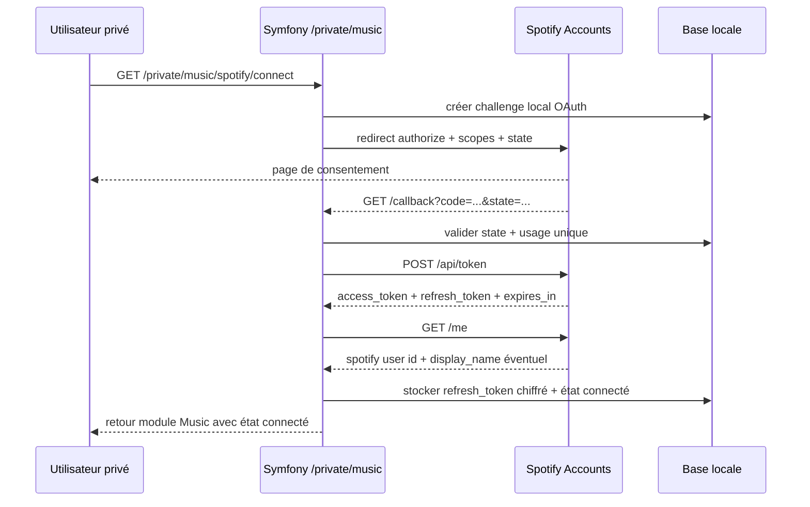

# Lot 1 - Connexion Spotify OAuth Sécurisée

Date de rédaction : 2026-06-29
Date de vérification Spotify : 2026-06-29

Ce document décrit le lot de connexion Spotify sécurisé pour le module privé Music.

## Faits Confirmés

Faits confirmés dans la documentation officielle Spotify :

- pour une application web serveur capable de protéger le secret client, Spotify recommande `Authorization Code` ;
- le redirect URI doit correspondre exactement à la valeur déclarée, sauf exception de port dynamique pour les loopbacks IP ;
- `localhost` n'est pas autorisé comme redirect URI ;
- HTTPS est requis hors loopback explicite ;
- le flux doit utiliser `state` et l'application doit rejeter la redirection si la valeur reçue ne correspond pas à celle émise ;
- l'échange du code contre un access token utilise `Authorization: Basic <base64 client_id:client_secret>` ;
- les access tokens expirent après 1 heure ;
- les refresh tokens expirent après 6 mois ;
- `invalid_grant` impose une nouvelle autorisation utilisateur.

Sources officielles :

- https://developer.spotify.com/documentation/web-api/concepts/authorization
- https://developer.spotify.com/documentation/web-api/concepts/redirect_uri
- https://developer.spotify.com/documentation/web-api/concepts/quota-modes
- https://developer.spotify.com/documentation/web-api/reference/get-current-users-profile
- https://developer.spotify.com/documentation/web-api/tutorials/code-flow
- https://developer.spotify.com/documentation/web-api/tutorials/refreshing-tokens

## Objectifs Du Lot

- connecter un compte Spotify personnel depuis la zone privée ;
- persister un refresh token chiffré ;
- exposer un état de connexion fiable ;
- préparer les lots de synchronisation sans encore implémenter les syncs avancées.

## Hors Périmètre

- synchronisation métier complète ;
- interface multi-comptes riche ;
- révocation distante automatisée si Spotify ne documente pas d'endpoint dédié ;
- gestion d'un fournisseur OAuth générique pour plusieurs plateformes.

## Application Spotify À Créer

Prérequis Spotify Developer Dashboard :

- créer une application dédiée au site privé ;
- renseigner au moins une redirect URI de production ;
- vérifier le mode `Development` et l'allowlist ;
- utiliser le même compte Spotify propriétaire que le compte personnel réellement synchronisé ;
- vérifier que le propriétaire conserve un abonnement Premium actif tant que l'application reste en `development mode`.

Redirect URIs probables :

- production : `https://benlemin.be/private/music/spotify/callback`
- local : à valider avant implémentation, avec préférence pour une URL HTTPS compatible avec la zone privée ; en fallback Spotify autorise `http://127.0.0.1:PORT/...`, pas `localhost`

## Flow OAuth Retenu

Décision recommandée :

- retenir `Authorization Code` ;
- ne pas retenir PKCE comme flow principal pour Symfony, car le backend peut stocker le secret client ;
- garder PKCE comme option documentée uniquement si un futur client natif ou navigateur apparaît.

Raisons :

- le projet est une application Symfony côté serveur ;
- le secret client peut être stocké en secrets Symfony ;
- le flow serveur simplifie le stockage du refresh token et les appels ultérieurs.

## Scopes Minimaux Recommandés

Scopes à demander dès le lot 1, pour éviter des reconsentements trop fréquents entre lots proches :

- `user-read-private`
- `user-library-read`
- `user-follow-read`
- `playlist-read-private`
- `playlist-read-collaborative`
- `playlist-modify-private`

Scope volontairement exclu pour l'instant :

- `playlist-modify-public`, car le besoin visé est la création de playlists privées.

Remarque :

- `user-read-email` n'est pas nécessaire pour le modèle cible et ne doit pas être demandé sans besoin concret.

## Flux Détaillé

## Routes Symfony Probables

- `GET /private/music/spotify`
- `POST /private/music/spotify/connect`
- `GET /private/music/spotify/callback`
- `POST /private/music/spotify/disconnect`
- `POST /private/music/spotify/refresh-now` seulement si un outil manuel s'avère utile

Recommandation :

- garder les routes Spotify sous le préfixe existant `/private/music` ;
- éviter de mélanger ce flux avec le contrôleur d'import d'archive déjà en place.

## Contrôleurs, Services Et Templates Probables

Contrôleurs probables :

- `SpotifyConnectionController`

Services probables :

- `SpotifyAuthorizeUrlBuilder`
- `SpotifyOAuthStateStore`
- `SpotifyAccountsClient`
- `SpotifyTokenManager`
- `SpotifyConnectionService`
- `SpotifyRefreshTokenCipher`

Templates probables :

- bloc de statut Spotify sur `templates/private/music/index.html.twig`
- fragment ou page de gestion de connexion, par exemple `templates/private/music/spotify/connection.html.twig`

## Gestion Du Paramètre `state`

Le `state` est obligatoire côté conception sécurité même si Spotify le décrit comme mécanisme de protection OAuth standard.

Règles recommandées :

- générer une valeur aléatoire forte ;
- stocker le hash du `state`, pas uniquement la valeur brute ;
- associer le `state` au propriétaire logique, à la session et à une date d'expiration courte ;
- usage unique ;
- rejeter tout callback si :
  - `state` absent ;
  - `state` inconnu ;
  - `state` expiré ;
  - `state` déjà consommé ;
  - code Spotify absent alors qu'aucune erreur explicite n'est retournée.

## Protection Contre Rejeu Et Retours Invalides

Recommandations :

- persister une trace d'autorisation en attente avec `consumedAt` ;
- consommer cette trace dans la même transaction que l'enregistrement de la connexion ;
- rejeter toute réutilisation d'un même callback ;
- tronquer tout message d'erreur externe stocké localement ;
- ne jamais refléter au navigateur un code, token ou payload Spotify brut.

## Modèle De Données Recommandé

`SpotifyConnection`

- `id`
- `ownerKey`
- `spotifyUserId`
- `spotifyDisplayName` nullable
- `spotifyProfileUri` nullable
- `spotifyProfileUrl` nullable
- `encryptedRefreshToken`
- `refreshTokenKeyVersion`
- `grantedScopes`
- `connectedAt`
- `lastTokenRefreshAt` nullable
- `lastSuccessfulSyncAt` nullable
- `lastFailureAt` nullable
- `lastTechnicalError` nullable
- `connectionState`

États probables :

- `connected`
- `refresh_required`
- `invalid`
- `disconnected`

Recommandation de design :

- ne prévoir qu'un seul propriétaire logique aujourd'hui ;
- exprimer malgré tout ce propriétaire en base pour éviter un singleton implicite.

## Secrets Et Chiffrement

### Secrets Symfony

Secrets probables à prévoir :

- `SPOTIFY_CLIENT_ID`
- `SPOTIFY_CLIENT_SECRET`
- `SPOTIFY_TOKEN_ENCRYPTION_KEY`

Recommandations :

- stocker ces valeurs via les Symfony Secrets déjà utilisés dans le projet ;
- ne jamais écrire ces valeurs dans `.env` de production ;
- ne pas réutiliser `APP_SECRET` comme clé de chiffrement de token ;
- utiliser une clé dédiée de 32 octets, encodée pour le stockage en secret.

### Chiffrement Du Refresh Token Au Repos

Décision recommandée :

- stocker le refresh token en base, chiffré applicativement avant persistence ;
- utiliser un petit service dédié de chiffrement, avec rotation de version de clé possible ;
- préférer `sodium` si disponible au moment de l'implémentation ; sinon documenter explicitement l'alternative retenue.

Pourquoi pas les Symfony Secrets pour le refresh token lui-même :

- le refresh token est créé et renouvelé dynamiquement à l'exécution ;
- les Symfony Secrets sont adaptés aux secrets de configuration, pas à un secret applicatif mutable à haute fréquence.

## Journalisation Et Données Sensibles

Interdictions explicites :

- ne pas journaliser l'access token ;
- ne pas journaliser le refresh token ;
- ne pas journaliser le code OAuth ;
- ne pas journaliser `client_secret` ;
- ne pas journaliser le header `Authorization` ;
- ne pas copier les query strings OAuth dans les messages de flash.

Autorisations limitées :

- code HTTP Spotify ;
- type d'erreur Spotify ;
- horodatage ;
- identifiant interne de tentative ;
- message technique tronqué et désensibilisé.

## Renouvellement Des Tokens

Règles recommandées :

- ne jamais persister l'access token sur le long terme si l'usage courant n'en a pas besoin ;
- obtenir un access token à la demande à partir du refresh token ;
- considérer l'access token comme éphémère, mémoire uniquement ;
- si le refresh retourne un nouveau refresh token, remplacer l'ancien atomiquement ;
- si Spotify renvoie `invalid_grant`, marquer la connexion `invalid` et exiger une reconnexion manuelle.

## Déconnexion Et Révocation

Décision pragmatique :

- la déconnexion locale supprime ou invalide localement le refresh token chiffré et remet l'état à `disconnected` ;
- aucune révocation distante automatisée ne doit être supposée tant qu'un endpoint Spotify officiel n'est pas documenté pour ce besoin ;
- la documentation d'interface devra indiquer que la révocation complète côté Spotify passe éventuellement par la gestion manuelle des accès du compte Spotify.

## Interface Privée Minimale

Éléments UI minimaux attendus :

- statut : connecté / non connecté / reconnexion requise ;
- identifiant Spotify connecté ;
- date de connexion ;
- scopes accordés ;
- date de dernière synchro réussie ;
- dernier échec technique non sensible ;
- bouton `Connecter Spotify` ;
- bouton `Déconnecter`.

## Stratégie De Tests

### Tests Unitaires

- génération de l'URL d'autorisation ;
- validation du `state` ;
- chiffrement / déchiffrement ;
- mapping de la réponse `/me` ;
- rotation de refresh token ;
- traitement de `invalid_grant`.

### Tests Fonctionnels Symfony

- accès protégé aux routes Spotify ;
- rejet d'un callback sans `state` valide ;
- création d'une connexion locale avec un faux client Spotify injecté ;
- déconnexion locale ;
- affichage de l'état de connexion dans l'UI.

### Tests Réseau

- exclus de la suite locale standard ;
- remplacés par doubles de `SpotifyAccountsClient`.

## Vérifications Manuelles Réelles

Tests navigateur à prévoir :

1. connexion initiale depuis le dashboard privé ;
2. refus du consentement Spotify ;
3. callback valide ;
4. callback rejoué ;
5. déconnexion locale ;
6. reconnexion après invalidation manuelle du refresh token ;
7. vérification qu'aucun secret n'apparaît dans les logs applicatifs.

## Migrations Probables

- création de `music_spotify_connections`
- création de `music_spotify_oauth_states` ou stockage équivalent des autorisations en attente
- éventuel index unique sur `owner_key`

## Critères D'Acceptation Du Lot 1

- une application Spotify dédiée est configurée avec les redirect URIs validées ;
- la zone privée permet de connecter un compte Spotify personnel ;
- le refresh token est stocké chiffré ;
- aucun secret n'est journalisé ;
- le statut de connexion est visible dans l'interface ;
- un token expiré se renouvelle sans redemander l'autorisation si le refresh token reste valide ;
- un refresh token invalide force une reconnexion explicite ;
- les tests unitaires et fonctionnels du lot passent sans appel réel à Spotify.

## Décisions À Valider Avant Implémentation

- stratégie exacte de l'hôte local de test ;
- forme de stockage du `state` ;
- choix final de primitive de chiffrement ;
- message UI exact pour le cas `invalid_grant`.
